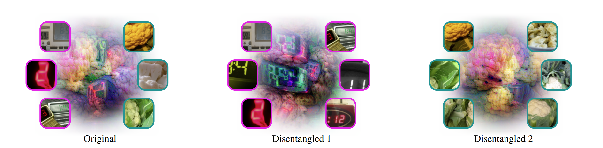

<div align="center">
<h1>Disentangling Polysemantic Channels in Convolutional Neural Networks (CVPRW 2025)</h1>

[**Robin Hesse**](https://robinhesse.github.io)<sup>1</sup>, [**Jonas Fischer**](https://www.mpi-inf.mpg.de/departments/computer-vision-and-machine-learning/people/jonas-fischer)<sup>2</sup>, [**Simone Schaub-Meyer**](https://schaubsi.github.io)<sup>1,3</sup>, [**Stefan Roth**](https://www.visinf.tu-darmstadt.de/visual_inference/people_vi/stefan_roth.en.jsp)<sup>1,3</sup>

<sup>1</sup>[Technical University of Darmstadt](https://www.visinf.tu-darmstadt.de/research_vi/index.en.jsp) <sup>2</sup>[Max Planck Institute for Informatics](https://www.mpi-inf.mpg.de/publications) <sup>3</sup>[hessian.AI](https://hessian.ai/research/)

<a href="https://arxiv.org/abs/2504.12939"></a>

<center>
    
</center>

</div>

## Running the Code

### Finding candidate channels

First, we need to find candidate channels that are relevant to multiple classes. To do so, we start by computing the attribution of each channel in the penultimate layer of a ResNet-50 to the respective target class of each sample in the training set:

```
CUDA_VISIBLE_DEVICES=0 python get_importances_for_classes.py --data_dir /datasets/imagenet/ --model resnet50 --batch_size 254 --store_dir /store_dir/
```

After running the command, you can find the attributions/channel importances of the last ResNet-50 layer in ```store_dir```. ATTENTION: This command requires 2,5TB of storage!

### Identifying gamma-polysemanticity in candidate channels

```
CUDA_VISIBLE_DEVICES=0 python get_cosine_similarities.py --model resnet50 --nr_channels_in_layer_of_interest 2048 --proportion_attribution_required 0.03 --p 0.75 --cos_sim_high 0.5
```

This command prints all gamma-polysemantic channels and the two corresponding classes for which the channel is important. The format looks like: ```[{'channel': 522, 'class1': 62, 'class2': 687, 'cosine_similarity': 0.4963}, ...]```. 
Additionally, the result are written to ```./results_get_cosine_similarities/resnet50_required0.03_p0.75_cossim0.0to0.5.txt```. 

### Disentangling polysemantic channels

Now that we have identified gamma-polysemantic channels, we can finally disentangle them - we just have to specify the channel and the two classes for which it is important. 

```
python disentangle_channel.py --data_dir /datasets/imagenet/ --model resnet50 --nr_channels_in_layer_of_interest 2048 --channel_disentangle 1660 --classes_for_concept1 530 --classes_for_concept2 938 --store_dir /store_dir/
```

The disentangled models are stored in ```store_dir/models_disentangled```

If you want to disentangle all channels that have been used in the paper, run (make sure you update data_dir and store_dir, e.g., by using ```Cmd + F & replace_all```):

```
sh disentanglement_calls.sh
```

### Qualitative plots

For obtaining the density plot, run:

```
python get_results.py --data_dir /datasets/imagenet --model_dir /store_dir/models_disentangled/ --model resnet50 --nr_channels_in_layer_of_interest 2048 --layer_of_interest last_conv --classes_for_concept1 530 --classes_for_concept2 938  --channel_of_interest 1660 --get_qualitative
```

This outputs the two density plots for the specified classes/channel in the folder ```./plots```.

### Quantitative analysis

for the quantitative analysis, run (make sure you update data_dir and model_dir, e.g., by using ```Cmd + F & replace_all```):

```
sh quantitative_evaluation_calls.sh
```

Running the commands creates two text files in ```./results_quantitative``` where the results for each included sample are appended. When running the quantitative analysis again or with different parameters, make sure to delete these text files so that results from the previous runs are not included. After all runs are finished, you can compute the average for each column, e.g., using Excel.
